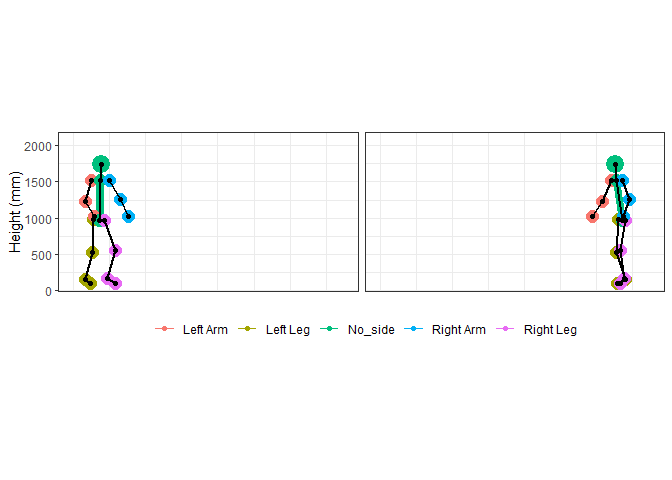
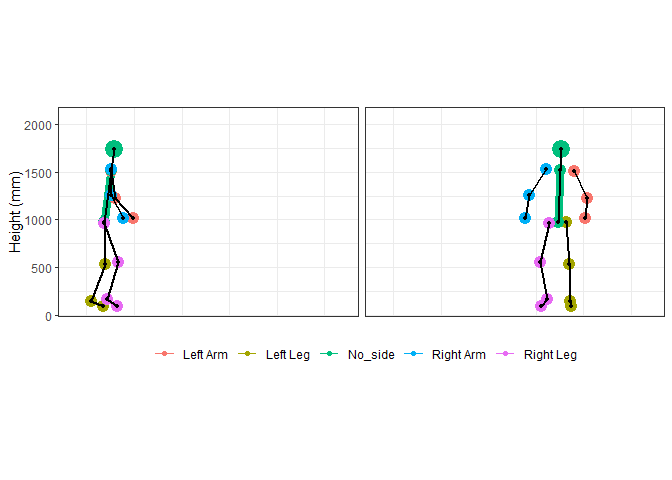
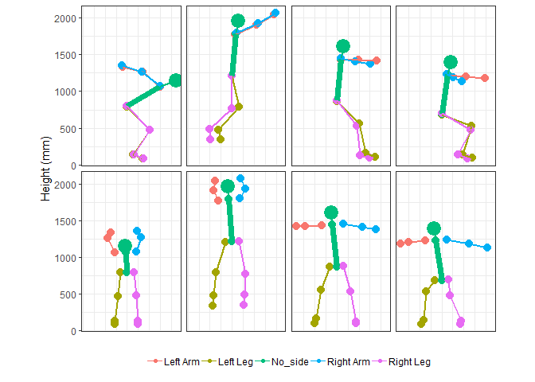

mocapr
================

<!-- README.md is generated from README.Rmd. Please edit that file -->

<!-- badges: start -->

[](https://travis-ci.com/steenharsted/mocapr)
[](https://ci.appveyor.com/project/steenharsted/mocapr)
[](https://www.tidyverse.org/lifecycle/#experimental)
<!-- badges: end -->

The goal of `mocapr` is to provide R functions to import, plot, animate,
and analyse motion capture data. The package is in **the very early
stages of development** and is only **minimally effective** in the sense
that it, at current, only supports import from [the
Captury](http://thecaptury.com/) system.

It should be possible to wrangle the motion capture data from other
systems into a format that will allow useage of the functions in this
package, as long as the data contains frame by frame *joint center
positions*. If you have such motion capture data from another system,
and if you are willing to share some sample data, I will be happy to
make an attempt at writing an import function and include both the
function and the sample data in this package.

`mocapr` uses a series of tidyverse packages to import
([`readr`](https://github.com/tidyverse/readr),
[`tidyr`](https://github.com/tidyverse/tidyr),
[`dplyr`](https://github.com/tidyverse/dplyr),
[`stringr`](https://github.com/tidyverse/stringr),
[`forcats`](https://github.com/tidyverse/forcats)), plot
([`ggplot2`](https://github.com/tidyverse/ggplot2)), animate
([`gganimate`](https://github.com/thomasp85/gganimate)), and analyse
motion capture data.  
The package also contains a sample data set `mocapr_data` which is
generated using some of the above packages as well as
[`purrr`](https://github.com/tidyverse/purrr).

While all functions should run without loading other libraries I
strongly recommend you load the tidyverse `library(tidyverse)` prior to
loading the mocapr library.

This is my first R package, and I’d be surprised if have gotten
everything right in the first try. Feedback and suggestions for
improvement and future developments are **most welcome**.

## Short on the story behind the package

My Ph.d. is a part of the project “Motor Skills in Pre-Schoolers”
([MiPS](https://www.ncbi.nlm.nih.gov/pmc/articles/PMC5576290/)). In MiPS
we have follow a cohort of \~950 pre-school children with yearly
follow-ups. Each follow-up consists of a series of tests and
examinations with one the tests being a series of squats and jumps
recorded using markerless motion capture. My Ph.d. project revolves
around collecting and analyzing this motion capture data, and the code
available in this package is a more general form of some of the code I
have written so far in for use in the project. My initial attempts at
approaching the data were made in Stata, but my work significantly
picked up speed after I was introduced to R in the summer of 2017, and
especially after I discovered the Tidyverse.

## Installation

`mocapr` can be installed directly from github using devtools:

``` r
# install.packages('devtools')
devtools::install_github('steenharsted/mocapr')
```

## The Sample Data `mocapr_data`

`mocapr_data` consists of 6 movements, each supplied with a number
(`movement_nr`) and a short description (`movement_description`). Raw
exports in .csv format can be found in the folder “data-raw”. Videos of
the movements with an overlay of the track is available at this [YouTube
playlist
Link](https://www.youtube.com/playlist?list=PLMjrjny4Ymmd1nSGHU0A6dWfEWjBxc-VQ).
These videoes are made using the Captury software.

Lets inspect the `mocapr_data`:

``` r
suppressPackageStartupMessages(library(tidyverse))
library(mocapr)

#Data
mocapr::mocapr_data %>% 
  group_by(movement_nr, movement_description) %>% 
  tidyr::nest()
```

    ## # A tibble: 6 x 3
    ##   movement_nr movement_description                            data         
    ##         <dbl> <chr>                                           <list>       
    ## 1           1 standing long jump for maximal performance      <tibble [172~
    ## 2           2 standing long jump with simulated poor landing~ <tibble [228~
    ## 3           3 normal gait in a straight line                  <tibble [157~
    ## 4           4 normal gait in a semi square                    <tibble [375~
    ## 5           5 vertical jump for maximal performance           <tibble [143~
    ## 6           6 caipoera dance                                  <tibble [1,2~

The format of the data is wide and contains frame by frame joint angles
and global joint center positions. As such each joint is typically
represented by 6 columns (3 angles and 3 positions). All joint related
variables are abbreviated according to their side (L|R),
joint(A|K|H|S|E|W), and
angle/position.

| Side      | Joint        | Angle/Position                                        |
| :-------- | :----------- | :---------------------------------------------------- |
|           | A (Ankle)    | F (Flexion)                                           |
| L (left)  | K (Knee)     | Varus                                                 |
|           | H (Hip)      | DF (Dorsi Flexion)                                    |
| R (Right) | W (Wrist)    | X (joint center position on the global X axis (floor) |
|           | E (Elbow)    | Y (joint center position on the global Y axis)(up)    |
|           | S (Shoulder) | Z (joint center position on the global Z axis)(floor) |

Example for left
knee:

| Abbreviated Variable Name |                   Meaning of abbreviation                   |
| :-----------------------: | :---------------------------------------------------------: |
|            LKF            |                      Left Knee Flexion                      |
|            LKX            | Left Knee joint center position on the X axis (floor plane) |

The focus of this tutorial is on plotting and animating motion capture
data. For this we only need the joint center positions. I will not
discuss the joint angles further, but feel free to explore them on your
own.

Lets first create some sample data:

``` r
jump_1 <- mocapr::mocapr_data %>% 
  filter(movement_nr == 1)

jump_2 <- mocapr::mocapr_data %>% 
  filter(movement_nr == 2)

gait <-  mocapr::mocapr_data %>% 
  filter(movement_nr == 4)

caipoera <- mocapr::mocapr_data %>% 
  filter(movement_nr == 6)
```

## Animate the data

The global coordinate system refers to a 3D coordinate system (X, Y, and
Z axis) that is created and oriented during the setup and calibration of
the system. Global joint center positions refer to the position of a
given joint inside the global coordinate system.  
The `animate_global()` function animates the subject using the global
joint center positions. It creates two animations one in the X and Y
plane and one in the Z and Y plane. If the subject is moving along
either the X or the Y axis the viewpoints will essentially be a side
view and a front|back view.

``` r
jump_1 %>% 
  animate_global(nframes = nrow(.), fps = 50)
```

<!-- -->

If the recorded subject moves at an angle to the axis’ of the global
coordinate system, animations and plots using global joint center
positions will have oblique viewpoints. When I performed `jump_2` I both
simulated a poor landing on the right knee and made sure that the
direction of the jump was oblique to the axis’ in the global coordinate
system. You can see that using the `animate_global()` function on
`jump_2` produces an animation with oblique viewpoints.

``` r
jump_2 %>% 
  animate_global(nframes = nrow(.), fps = 50)
```

<!-- -->

In many cases out of axis movement is easy to prevent, and here the
`animate_global()` function might be sufficient, but in other cases
(e.g. working with pre-school children or more complicated movements
than walking), out of axis movement is difficult to prevent - at least
without interfering in the spontaneous movements of the subject. Also
the the orientation of the global coordinate system differs from system
to system and sometimes even between different setups of the same
motion-capture system.  
For the purpose of analyzing or interpreting motions, oblique viewpoints
are, in general, less optimal. This creates a need for animation and
plotting functions that are free from the orientation of the global
coordinate system, and instead focused on the subject or the direction
of the movement the subject is performing. `mocapr` solves this
challenge by providing two functions that projects the global joint
center positions onto the planes of the movement direction
(`project_full_body_to_MP()`) or the anatomical planes the subject
(`project_full_body_to_AP()`). You can think of these functions as
functions that creates new coordinate systems that are just
**shifted/tilted** version of the global coordinate system. Each project
function should then be followed by it’s corresponding animation
function (`animate_movement()` or `animate_anatomical()`)

Lets look again at `jump_2` (the jump that is oblique to the global
coordinate system), and animate the jump using the `animate_movement()`
and the `animate_anatomical()` functions.

``` r
jump_2 %>%
  #Project to the movements planes
  project_full_body_to_MP() %>%
  #Animate the movement plane projections
  animate_movement(nframes = nrow(.), fps = 50, rewind = FALSE)
```

<!-- -->

``` r
jump_2 %>% 
  #Project to the anatomical Planes 
  project_full_body_to_AP() %>% 
  #Animate the anatomical projections
  animate_anatomical(nframes = nrow(.), fps = 50, rewind = FALSE)
```

<!-- -->

*note: the right side appears on the right side in the anatomical
animation and on the left side in the movement animation, this is
intentional but might change in future versions*.

Besides the size difference the two animations are very similar. This is
because the movement that the subject is performing is uni-directional.
For movements where the subject is moving in one direction without
rotation (such as walking in a straight line, or jumping using both
legs) the two projections and the following animations will produce
similar results, but the results will differ greatly if the direction of
the movement changes throughout the recording.

Lets explore the difference between the two types of projections by
looking at a movement that is not unidirectional.

``` r
gait %>%
  #Project to the movements planes
  project_full_body_to_MP() %>%
  #Animate the movement plane projections
  animate_movement(nframes = nrow(.), fps = 50, height = 800, width = 800)
```

<!-- -->

``` r
gait %>% 
  #Project to the anatomical Planes 
  project_full_body_to_AP() %>% 
  #Animate the anatomical projections
  animate_anatomical(nframes = nrow(.), fps = 50, height = 800, width = 800)
```

<!-- -->

Now the difference between the two types of animations is evident. While
both the animate\_movement() and the animate\_anatomical() gives you two
view points that are perpendicular to each other, animate\_movement()
gives you *fixed viewpoints* (you are standing still and watching the
movement) and animate\_anatomical() *updates your viewpoint for each
frame* (you are always the watching the subject from the front and the
side of the pelvis).

## using `mocapr` to plot

The three animate functions can be used to plot if you supply the
argument `animate = FALSE`. In that case the you will get a plot that is
faceted on the frames. I suggest you reduce the number of frames before
you use the functions to plot.

``` r
jump_2 %>% 
  project_full_body_to_AP() %>% 
  filter( frame == 120 | frame == 150 | frame == 165 | frame == 170) %>% 
  animate_anatomical(animate = FALSE)
```

<!-- -->

## Options

the width and height arguments can be used to specify width and height I
find slow-mo effects is best achieved by adding more rows, e.g.,
`nrow(.)*2`

``` r
caipoera %>% 
  filter(frame > 48 & frame < 223) %>% 
  project_full_body_to_MP() %>% 
  animate_movement(nframes = nrow(.)*2, fps = 50, width = 600, height = 600)
```

<!-- -->
