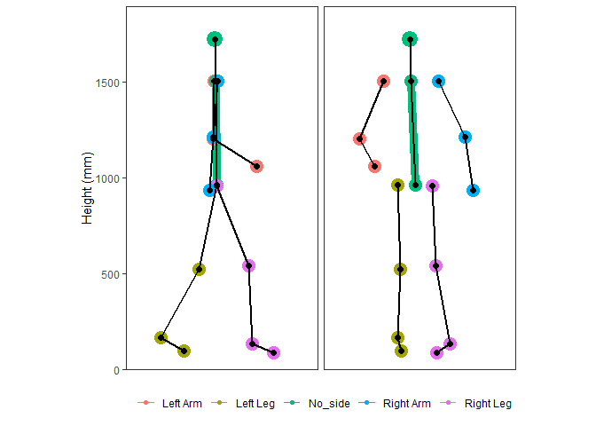
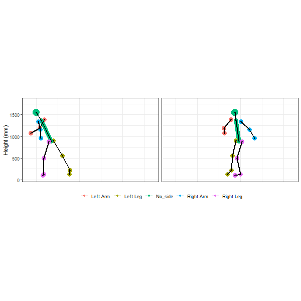

mocapr
================

<!-- README.md is generated from README.Rmd. Please edit that file -->

<!-- badges: start -->

[](https://travis-ci.org/steenharsted/mocapr)
[](https://ci.appveyor.com/project/steenharsted/mocapr)
<!-- badges: end -->

The goal of `mocapr` is to provide researchers or clinicians with R
functions that can import, plot, animate, and analyse motion capture
data. The package is in **the very early experimental stages of
development** and is only **minimally effective** in the sense that it,
currently, only supports import from [the
Captury](http://thecaptury.com/) system.

It should be possible to wrangle motion capture data from other systems
into a format that will allow usage of the functions in this package, as
long as the data contains frame by frame joint center positions. If you
have such motion capture data from other systems, and if you are willing
to share some sample data, I will be happy to make an attempt at writing
an import function and include both the function and the sample data in
this package.

`mocapr` uses a series of tidyverse packages to import
([`readr`](https://github.com/tidyverse/readr),
[`tidyr`](https://github.com/tidyverse/tidyr),
[`dplyr`](https://github.com/tidyverse/dplyr),
[`stringr`](https://github.com/tidyverse/stringr),
[`forcats`](https://github.com/tidyverse/forcats)), plot
([`ggplot2`](https://github.com/tidyverse/ggplot2)), animate
([`gganimate`](https://github.com/thomasp85/gganimate)), and analyse
motion capture data.  
The package also contains a sample data set `mocapr_data` which is
generated using some of the above packages as well as
[`purrr`](https://github.com/tidyverse/purrr).

While all functions should run without loading other libraries I
strongly recommend you load the tidyverse `library(tidyverse)` prior to
loading the mocapr library.

This is my first R package. I am sure I have much to learn in this area,
but I am less sure of what it is I actually need to learn. Feedback and
suggestions for improvement and future developments are **most
welcome**.

## Short on the story behind the package

I am a Ph.d. student at The Department of Sports Science and Clinical
Biomechanics, Faculty of Health Sciences at the University of Southern
Denmark (SDU). My work is a part of the project “Motor Skills in
Pre-Schoolers”([MiPS](https://www.ncbi.nlm.nih.gov/pmc/articles/PMC5576290/)),
which is led by Lise Hestbæk.  
In MiPS we follow a cohort of \~950 pre-school children with yearly
follow-ups. At each follow-up we collect data using markerless motion
capture of the children as they perform a series of jumps and squats. My
Ph.d. project revolves around collecting and analyzing this motion
capture data, and the code available in this package is a more general
form of some of the code I have written so far for use in this project.
My initial attempts at approaching the data were made in Stata, but my
work significantly picked up speed after I was introduced to R in the
summer of 2017, and especially after I discovered the Tidyverse.

I have found R to be completely capable of working with large amounts of
motion capture data, and I hope this package can, at least, serve as an
inspiration as to how R can be utilized outside of statistics.

## Installation

`mocapr` can be installed directly from github using devtools:

``` r
# install.packages('devtools')
devtools::install_github('steenharsted/mocapr')
```

You may have to install additional packages manually that are needed in
order to run `gganimate` functions.

### Core Functions

`mocapr` contains six core functions and some sample data
`mocapr_data`.  
The six core functions are: one import function (`import_captury()`),
two functions that project joint-center positions
(`project_full_body_to_AP()` and `project_full_body_to_MP()`), and three
functions to animate (`animate_global()`, `animate_anatomical()`, and
`animate_movement()`).  
The intended workflow of the six core functions is visualized below.


### The Sample Data `mocapr_data`

`mocapr_data` consists of 6 movements, each supplied with a number
(`movement_nr`) and a short description (`movement_description`). Videos
of the movements with an overlay of the track is available at this
[YouTube
playlist](https://www.youtube.com/playlist?list=PLMjrjny4Ymmd1nSGHU0A6dWfEWjBxc-VQ).
The videos are made using the CapturyLive software.

The data is also available as raw exports in .csv format, and can be
found in the folder “data-raw”.

Lets load `mocapr` and inspect the `mocapr_data`:

``` r
library(tidyverse)
library(mocapr)

#Data
mocapr_data %>% 
  group_by(movement_nr, movement_description) %>% 
  nest()
```

    ## # A tibble: 6 x 3
    ##   movement_nr movement_description                            data         
    ##         <dbl> <chr>                                           <list>       
    ## 1           1 standing long jump for maximal performance      <tibble [172~
    ## 2           2 standing long jump with simulated poor landing~ <tibble [228~
    ## 3           3 normal gait in a straight line                  <tibble [157~
    ## 4           4 normal gait in a semi square                    <tibble [375~
    ## 5           5 vertical jump for maximal performance           <tibble [143~
    ## 6           6 caipoera dance                                  <tibble [1,2~

The format of the data is wide and contains frame by frame joint angles
and global joint center positions. Therefore, each joint is typically
represented by 6 columns (3 angles and 3 positions). To prevent long
repetitive column names, all joint related variables are abbreviated
according to their side (L|R), joint(A|K|H|S|E|W), and
angle|position.

| Side      | Joint        | Angle/Position                                        |
| :-------- | :----------- | :---------------------------------------------------- |
|           | A (Ankle)    | F (Flexion)                                           |
| L (left)  | K (Knee)     | Varus                                                 |
|           | H (Hip)      | DF (Dorsi Flexion)                                    |
| R (Right) | W (Wrist)    | X (joint center position on the global X axis (floor) |
|           | E (Elbow)    | Y (joint center position on the global Y axis)(up)    |
|           | S (Shoulder) | Z (joint center position on the global Z axis)(floor) |

Example for left
knee:

| Abbreviated Variable Name |                   Meaning of abbreviation                   |
| :-----------------------: | :---------------------------------------------------------: |
|            LKF            |                      Left Knee Flexion                      |
|            LKX            | Left Knee joint center position on the X axis (floor plane) |

The focus of this tutorial is on plotting and animating motion capture
data. For this we only need the joint center positions. I will not
discuss the joint angles further, but feel free to explore them on your
own.

## Animating Motion Capture Data With `mocapr`

Lets first create some sample data:

``` r
jump_1 <- mocapr::mocapr_data %>% 
  filter(movement_nr == 1)

jump_2 <- mocapr::mocapr_data %>% 
  filter(movement_nr == 2)

gait <-  mocapr::mocapr_data %>% 
  filter(movement_nr == 4)

capoeira <- mocapr::mocapr_data %>% 
  filter(movement_nr == 6)
```

### Animating with `animate_global()`

The global coordinate system refers to a 3D coordinate system (X, Y, and
Z axis) that is created and oriented during the setup and calibration of
many motion capture systems. Global joint center positions refer to the
position of a given joint center inside the global coordinate system.  
The `animate_global()` function animates the subject using the global
joint center positions. It creates two animations: one in the X and Y
plane; and one in the Z and Y plane. If the subject is moving along
either the X or the Y axis the viewpoints will essentially be a side
view and a front|back view.

``` r
jump_1 %>% 
  animate_global(nframes = nrow(.), fps = 50)
```

<!-- -->

If the recorded subject moves at an angle to the axis’ of the global
coordinate system, animations and plots using global joint center
positions will have oblique viewpoints. When I performed `jump_2` I both
simulated a poor landing on the right knee and made sure that the
direction of the jump was oblique to the axis’ in the global coordinate
system. Therefore, using the `animate_global()` function on `jump_2`
produces an animation with oblique viewpoints.

``` r
jump_2 %>% 
  animate_global(nframes = nrow(.), fps = 50)
```

<!-- -->

### Animating with `animate_movement()` and `animate_anatomical()`

In many cases, out of axis movement and oblique viewpoints are easy to
prevent. In these cases the `animate_global()` function might be
sufficient, but in other cases, such as working with with pre-school
children, out of axis movement is difficult to prevent without
interfering in the spontaneous movements of the subject. Oblique
viewpoints may also stem from differences in the orientation of the
global coordinate system between motion capture systems or between
different setups of the same motion-capture system.

For the purpose of analyzing or interpreting motions, oblique viewpoints
are, in general, less optimal. This creates a need for animation and
plotting functions that are free from the orientation of the global
coordinate system, and instead focused on either the subject itself or
the direction of the movement the subject is performing. `mocapr` solves
this challenge by providing two functions that projects the global joint
center positions onto the planes of the movement direction
(`project_full_body_to_MP()`) or the anatomical planes the subject
(`project_full_body_to_AP()`). You can think of these functions as
functions that creates new coordinate systems that are just
**shifted/tilted** version of the global coordinate system, such that
animations that use the joint center positions in the new coordinate
systems will have viewpoints that are directly in front of and to the
side of the direction of the movement (`animate_movement()`) or the
person (`animate_anatomical()`).

The direction of the movement is determined by the position of the
subject at the first and the last frame of the recording.

These functions are best explained by looking at animations.

Lets look again at `jump_2` (the jump that is oblique to the global
coordinate system), and animate the jump using the `animate_movement()`
and the `animate_anatomical()` functions.

``` r
jump_2 %>%
  #Project to the movements planes
  project_full_body_to_MP() %>%
  #Animate the movement plane projections
  animate_movement(nframes = nrow(.), fps = 50, rewind = FALSE)
```

<!-- -->

``` r
jump_2 %>% 
  #Project to the anatomical Planes 
  project_full_body_to_AP() %>% 
  #Animate the anatomical projections
  animate_anatomical(nframes = nrow(.), fps = 50, rewind = FALSE)
```

<!-- -->

*note: the right side appears on the right side in the anatomical
animation and on the left side in the movement animation, this is
intentional but might change in future versions*.

Besides the size difference the two animations are very similar. This is
because the movement that the subject is performing is uni-directional.
For movements where the subject is moving in one direction with limited
rotation of the pelvis (such as walking in a straight line, or jumping
using both legs) the two projections and the following animations will
produce similar results, but the results will differ greatly if the
direction of the movement changes throughout the recording.

Lets explore the difference between the two types of projections by
looking at a movement that is not unidirectional.

#### animate\_movement()

``` r
gait %>%
  #Project to the movements planes
  project_full_body_to_MP() %>%
  #Animate the movement plane projections
  animate_movement(nframes = nrow(.), fps = 50)
```

<!-- -->

#### animate\_anatomical()

``` r
gait %>% 
  #Project to the anatomical Planes 
  project_full_body_to_AP() %>% 
  #Animate the anatomical projections
  animate_anatomical(nframes = nrow(.), fps = 50)
```

<!-- -->

Now the difference between the two types of animations is evident.
`animate_movement()` gives you *fixed viewpoints* (you are standing
still and watching the movement) and `animate_anatomical()` *updates
your viewpoint for each frame* (you are always watching the subject from
the back and the side of the pelvis).

## using `mocapr` to plot

The three animate functions can be used to plot if you supply the
argument `return_plot = TRUE`. I suggest you reduce the number of frames
before you use the functions to plot.

``` r
jump_2 %>% 
  project_full_body_to_AP() %>% 
  filter(frame %in% c(100, 110, 120, 130, 140, 150, 160, 170, 180, 190, 200)) %>% 
  animate_anatomical(planes = c("F"),
                     planes_in_rows_or_cols = c("cols"), 
                     use_geom_point = FALSE, # use ggforce::geom_circle()
                     row_facets = NULL, 
                     col_facets = frame, 
                     return_plot = TRUE)+
  theme(
    strip.text.x = element_blank(),#Remove the facet labels above each frame
    legend.position = "none") #Remove the legend
```

<!-- -->

## Options

the width and height arguments can be used to specify width and height I
find slow-mo effects is best achieved by adding more rows, e.g.,
`nrow(.)*2`

``` r
capoeira %>% 
  filter(frame > 48 & frame < 223) %>% 
  project_full_body_to_MP() %>% 
  animate_movement(nframes = nrow(.)*2, fps = 50, width = 600, height = 600)
```

<!-- -->
