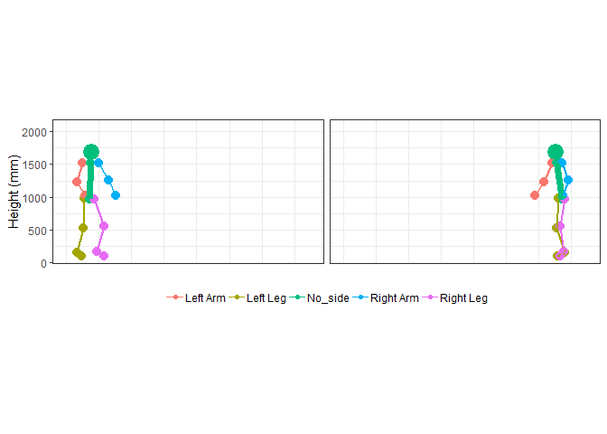
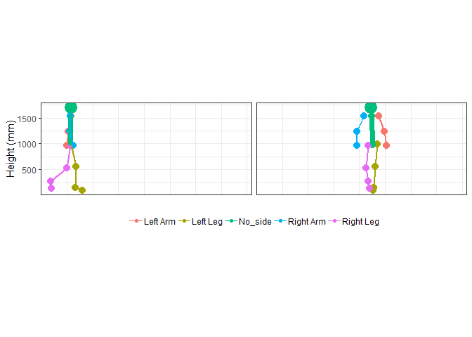
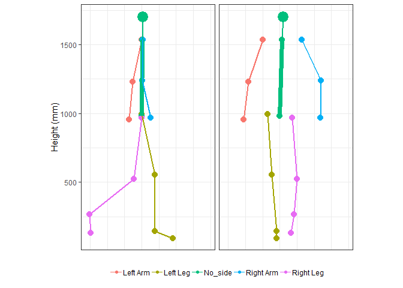

mocapr
================

<!-- README.md is generated from README.Rmd. Please edit that file -->

The goal of `mocapr` is to provide R functions to import, plot, animate,
and analyse motion capture data.

`mocapr` uses a series of tidyverse packages to import
([`readr`](https://github.com/tidyverse/readr),
[`tidyr`](https://github.com/tidyverse/tidyr),
[`dplyr`](https://github.com/tidyverse/dplyr),
[`stringr`](https://github.com/tidyverse/stringr),
[`forcats`](https://github.com/tidyverse/forcats)), plot
([`ggplot2`](https://github.com/tidyverse/ggplot2)), animate
([`gganimate`](https://github.com/thomasp85/gganimate)), and analyse
motion capture data.  
The package also contains a sample data set `MOCAP_data` which is
generated using some of the above packages as well as
[`purrr`](https://github.com/tidyverse/purrr).

While all functions should run without loading other libraries I
strongly recommend you load the tidyverse `library(tidyverse)`.

The package is in **the very early stages of development** and is only
minimally effective in the sense that it, at current, only supports
import from [the Captury](http://thecaptury.com/) system. My clear
intent is to make this package work with motion capture data from
different sources, and I expect to add a function that imports data from
[the Kinetisense](https://kinetisense.com/) system shortly.  
If you have motion capture data that contains frame by frame joint
center positions from other systems, it should be possible to wrangle
the data into a format that will allow you to use the functions in this
package. If you are willing to share the data, I will be happy to help
you write an import function and include both the function and the data
in this package.  
Feedback and suggestions for improvement and future developments are
**most welcome**.

## Installation

`mocapr` can be installed directly from github using devtools:

``` r
# install.packages('devtools')
devtools::install_github('steenharsted/mocapr')
```

## The Sample Data `MOCAP_data`

All data included in the package is, at current, captured using the
Captury Live markerless motion capture system. Raw exports in .csv
format can be found in the folder “data-raw”.  
Each movement is also supplied with avi file showing the recording with
an overlay of the tracked poses. Unfortunately, these avi files can’t be
uploaded to GitHub due to their size (suggestions are welcome, I am
considering putting them on YouTube and adding links from there).

A first look on the data

``` r
suppressPackageStartupMessages(library(tidyverse))
library(mocapr)

#Data
mocapr::MOCAP_data %>% 
  group_by(movement_nr, movement_description) %>% 
  tidyr::nest()
```

    ## # A tibble: 6 x 3
    ##   movement_nr movement_description                            data         
    ##         <dbl> <chr>                                           <list>       
    ## 1           1 standing long jump for maximal performance      <tibble [172~
    ## 2           2 standing long jump with simulated poor landing~ <tibble [228~
    ## 3           3 normal gait in a straight line                  <tibble [157~
    ## 4           4 normal gait in a semi square                    <tibble [375~
    ## 5           5 vertical jump for maximal performance           <tibble [143~
    ## 6           6 caipoera dance                                  <tibble [1,2~

The data contains frame by frame joint angles and global joint center
positions. All joint related variables are abbreviated according to
their side (L|R), joint(A|K|H|S|E|W), and angle/position. As such each
joint is typically represented by 6
columns.

| Side      | Joint        | Angle/Position                                        |
| :-------- | :----------- | :---------------------------------------------------- |
|           | A (Ankle)    | F (Flexion)                                           |
| L (left)  | K (Knee)     | Varus                                                 |
|           | H (Hip)      | DF (Dorsi Flexion)                                    |
| R (Right) | W (Wrist)    | X (joint center position on the global X axis (floor) |
|           | E (Elbow)    | Y (joint center position on the global Y axis)(up)    |
|           | S (Shoulder) | Z (joint center position on the global Z axis)(floor) |

Example for left
knee:

| Abbreviated Variable Name |                   Meaning of abbreviation                   |
| :-----------------------: | :---------------------------------------------------------: |
|            LKF            |                      Left Knee Flexion                      |
|            LKX            | Left Knee joint center position on the X axis (floor plane) |

The focus of this tutorial is on ploting and animating motion capture
data. For this we only need the joint center positions, and I will not
discuss the joint angles further. Feel free to explore them on your own.

Lets first create some sample data:

``` r
gait_1 <- mocapr::MOCAP_data %>%
  filter(movement_nr == 3)

gait_2 <- mocapr::MOCAP_data %>%
  filter(movement_nr == 4)

caipoera <- mocapr::MOCAP_data %>% 
  filter(movement_nr == 6)

jump_1 <- mocapr::MOCAP_data %>% 
  filter(movement_nr == 1)

jump_2 <- mocapr::MOCAP_data %>% 
  filter(movement_nr == 2)
```

The global joint center positions can be used for plots and animations
using the `animate_global()` function.

``` r
jump_1 %>% 
  animate_global(nframes = nrow(.), fps = 50)
```

<!-- -->

Plots and animations using global joint center positions will cause a,
less optimal, oblique viewpoint if the subject moves at an angle to the
axis of the global coordinate system.

``` r
jump_2 %>% 
  animate_global(nframes = nrow(.), fps = 50)
```

<!-- -->

In many cases, such as gait analysis on adults, out of axis movement
will be easy to prevent, but if one is working with other subjects, such
as pre-school children, or more complicated movements, such as caipoera,
out of axis movement is likely to occur. `mocapr` solves this challenge
by providing two functions that projects the global joint center
positions onto the planes of the movement direction
(`project_full_body_to_MP()`) or the anatomical planes the subject
(`project_full_body_to_AP()`).

The movement planes are:  
\* Forward) a plane perpendicular to the floor, going in the direction
from the position of the subject at the first frame to the position of
the subject at the last frame.  
\* Side-wards) a plane perpendicular to the floor and the forwards
plane.

The anatomical planes are:  
\* Frontal) a plane perpendicular to the floor, going through both
hip-joint centers.  
\* Sagital) a plane perpendicular to the floor and the Frontal plane.

For movements where the subject is moving in one direction without
rotation (such as walking in a straight line, or jumping using both
legs) these two projections will be very similar to each other, but they
will differ greatly if the direction of the movement changes.This is
best explained by watching the animations produced by the animation
functions `mocapr::animate_movement()` and
`mocapr::animate_anatomical()`.

### Example 1.A (walking straight movement plane)

``` r
gait_1 %>%
  #Project to the movements planes
  project_full_body_to_MP() %>%
  #Animate the movement plane projections
  animate_movement(nframes = nrow(.), fps = 50, rewind = FALSE)
```

<!-- --> \#\#\#
Example 1.B (walking straight anatomical plane)

``` r
gait_1 %>% 
  #Project to the anatomical Planes 
  project_full_body_to_AP() %>% 
  #Animate the anatomical projections
  animate_anatomical(nframes = nrow(.), fps = 50, rewind = FALSE)
```

<!-- -->

Besides the size difference the two animations are very similar (note:
the right side appears on the right side in the anatomical animation and
on the left side in the movement animation, this is intentional but
might change in future versions).

### Example 2.A (walking in a semi square movement plane)

``` r
gait_2 %>%
  #Project to the movements planes
  project_full_body_to_MP() %>%
  #Animate the movement plane projections
  animate_movement(nframes = nrow(.), fps = 50, rewind = FALSE)
```

<!-- -->

### Example 2.B (walking in a semi square anatomical plane)

``` r
gait_2 %>% 
  #Project to the anatomical Planes 
  project_full_body_to_AP() %>% 
  #Animate the anatomical projections
  animate_anatomical(nframes = nrow(.), fps = 50, rewind = FALSE)
```

<!-- -->

Now the difference between the two types of animations is evident. While
both the animate\_movement() and the animate\_anatomical() gives you two
view points that are perpendicular to each other, animate\_movement()
gives you *fixed viewpoints* (you are standing still and watching the
movement) and animate\_anatomical() *updates your viewpoint for each
frame* (you are always the watching the subject from the front and the
side of the pelvis).

## using `mocapr` to plot

Both the animate\_anatomical() and animate\_movement() functions can be
used to plot if you supply the argument `animate = FALSE`. In that case
the you will get a plot that is faceted on the frames. I suggest you
reduce the number of frames before you use the functions to plot.

``` r
jump_2 %>% 
  project_full_body_to_AP() %>% 
  filter( frame == 120 | frame == 150 | frame == 165 | frame == 170) %>% 
  animate_anatomical(animate = FALSE)
```

<!-- -->
